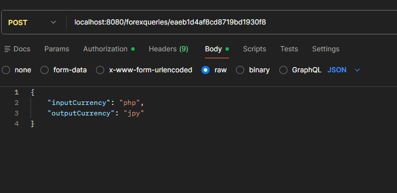

# ForexAPI
A foreign currencies exchange rate Rest API built with SpringBoot JPA and MySQL. Navigate to the corresponding endpoints to create, read or delete queries from a database. The API is mostly for learning purposes but was also driven by my interests in stocks and forex.
## Technologies
- `Java 17`
- `Exchange Rate API`
- `SQL`
- `SpringBoot JPA`
- `Postman`
- `MySQL`
- `ExchangeRate-API`
## Functionalities
Here are the list of things the API can do:
- creating a query from a JSON file with the list of input currency and output currency
- persisting that query into a MySQL database
- displaying that query with the corresponding time, date, and exchange rate
- querying all prior requests
- querying a specific request based on a unique query number
- querying for a list of requests based on input currency
- deleting a query from the database using a query number
- deleting multiple queries from the database using an input currency
## The Process
First I created the directory and table for the forex queries using SQL in MySQL. Then I created the forex query entity that would match up with the table.
 
 
Then came the service level, DAO and the controller. The three most important functionalities for this API was creation, reading and deletion. With that in mind, I had to expose the endpoints for said functions along with the ability to read from a path variable or from a JSON file.
## Running the Project
1. Clone the repository
2. Procure an [ExchangeRate-API](https://www.exchangerate-api.com/) key
3. Make sure you have Java 17 SDK and the [MySQL WorkBench + Database](https://dev.mysql.com/downloads/installer/) installed
4. Make sure you have your bin directory of your [Maven Folder](https://maven.apache.org/download.cgi) set in your path variables
5. Create or use an existing connection in MySQL
6. Run the `forex-directory` SQL script in MySQL
7. In the `ForexAPI\src\main\resources` directory, open the `application.properties` with notepad
8. In the `spring.datasource.url` enter your host name and port for your connection
9. Enter the `username` and `password` for your connection
10. Then using `cmd` move to the directory where the `pom.xml` file in the `ForexAPI` directory is located
11. Run `mvn compile`
12. Finally, run `mvn exec:java -Dexec.mainClass=com.dev.forex.ForexApplication`
## How to Use the API
[Postman](https://www.postman.com/) is required to access the mappings for deletion and posting
- `http://localhost:8080/forexqueries`: Get Method
  - Used to get a list of all queries in the database
- `http://localhost:8080/forexqueries/{[a-zA-Z]{3}}`: Get Method
  - Returns all queries in the database that use the input currency of the path variable
- `http://localhost:8080/forexqueries/int/{queryNumber}`: Get Method
  - Returns a specific query from the database with the matching query number of the path variable
- `http://localhost:8080/forexqueries/{api-key}`: Post Method
  - 
